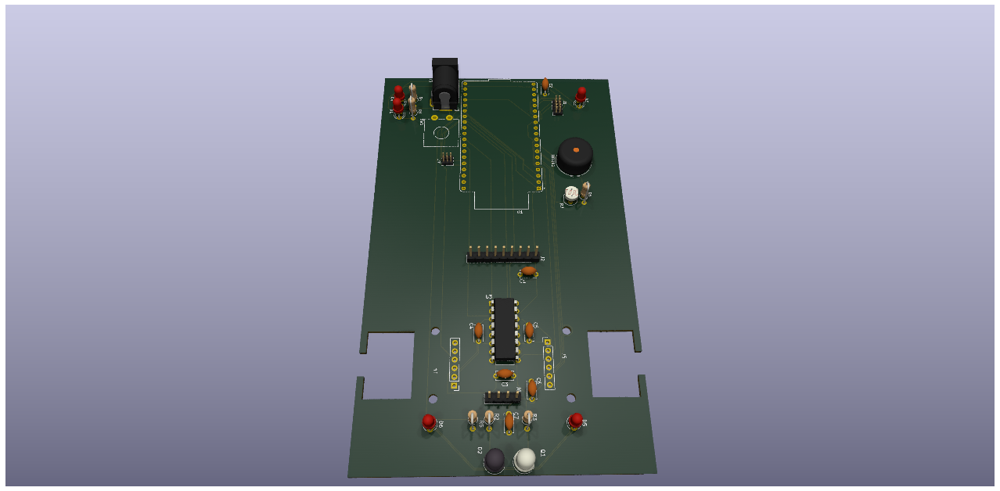

# REDHAWK ESP32 Robot

Custom PCB-based robot designed and built for the Seattle University Embedded Systems & Design course. The board centers on an ESP32 microcontroller and includes motor drive, quadrature encoders, distance sensing, line following, ambient light sensing, audio output, and Wi-Fi. This repository contains the full KiCad hardware design, power-on functional test firmware, and supporting documentation.





---

## Repository Structure

```
Embedded-Systems/
├── Mitchel_Ezekiel_Robot/       # KiCad PCB and schematic project
├── PowerOn_Functional_Test/     # PlatformIO firmware — hardware self-test
└── Interrupts/                  # Interrupt lab (placeholder)
```

---

## PCB Design

KiCad 9.0 project containing the full schematic and two-layer PCB layout.

```
Mitchel_Ezekiel_Robot/
├── Mitchel_Ezekiel_Robot.kicad_pcb
├── Mitchel_Ezekiel_Robot.kicad_sch
├── Mitchel_Ezekiel_Robot.kicad_pro
├── Mitchel_Ezekiel_Robot.kicad_prl
├── Ezekiel_Mitchell_ESP32_Robot_Schematic.kicad_pro
├── sym-lib-table
├── docs/
│   ├── ESP32EmeddedRobot_Design-GetStarted-v00-1-10-2025a.pdf
│   └── images/
├── deliverables/
│   └── Ezekiel_Mitchell_ESP32_Robot_Schematic.kicad_sch
└── downloadables/
    ├── 0-My_Library.kicad_sym
    └── 0-My-Library.pretty/
```

### Hardware Overview

#### Microcontroller

| Part | Description |
|------|-------------|
| ESP32-DEVKITC-32E (U1) | Main MCU — dual-core Xtensa LX6, Wi-Fi + Bluetooth |

#### Motor Drive

| Part | Description |
|------|-------------|
| L293D (U3) | Dual H-bridge motor driver (DIP-16) |
| Pololu-3675 | Gear motors with quadrature encoders (x2) |
| Pololu-2691 / Ball-Caster-1 | Ball caster (rear support) |

#### Sensors and I/O

| Part | Description |
|------|-------------|
| R7 — R_Photo | LDR photoresistor (ambient light sensing) |
| D2 — LD274 | IR LED emitter (line detection) |
| Q1 — SFH300 | IR phototransistor receiver |
| HC-SR04 | Ultrasonic distance sensor (TRIG / ECHO) |
| HORN1 — Buzzer | Audio feedback (TDK PS1240P02BT) |
| D1, D3-D6 — LED | Status indicator LEDs (x5, 3 mm) |
| SW1 — SW_SPST | Tactile on/off switch |

#### Communication and Debug

| Part | Description |
|------|-------------|
| J2 — GPS MODULE | GPS module connector (UART: GPS_TX / GPS_RX) |
| J1 — JTAG | 1.27 mm 2x5 JTAG/SWD debug header |

#### Connectors

| Ref | Value | Description |
|-----|-------|-------------|
| J3 | Barrel_Jack_Switch | Battery input (horizontal barrel jack) |
| J4 | Conn_01x06 | General 6-pin header |
| J5 | Conn_01x06 | General 6-pin header |
| J6 | Conn_01x04 | General 4-pin header |
| J7 | Conn_02x03_Odd_Even | Motor / encoder connector (2x3) |

#### Passives and Power

| Ref | Value | Notes |
|-----|-------|-------|
| C1, C5-C7 | 0.1 uF | Decoupling capacitors |
| C2, C3 | 47 uF | Bulk filter capacitors |
| R1, R2 | 1 kOhm | Pull-up / current limiting |
| R3 | 47 kOhm | Pull-up for IR receiver circuit |
| R4, R5 | 330 Ohm | LED current limiting |
| R6 | 10 kOhm | Voltage divider (LDR / sensor bias) |

Power rails: `+BATT` (battery input), `+3V3` (regulated 3.3 V from ESP32 module)

### PCB Net Classes

| Net Class | Track Width | Via Diameter | Via Drill | Notes |
|-----------|-------------|--------------|-----------|-------|
| Power | 0.5 mm | 1.0 mm | 0.5 mm | VCC, GND rails |
| Motor | 0.8 mm | 1.2 mm | 0.6 mm | H-bridge output lines |
| High Speed / GPS | 0.2 mm | 0.8 mm | 0.4 mm | GPS UART, high-frequency signals |
| Default | 0.2 mm | 0.8 mm | 0.3 mm | General signals |

### Custom Libraries

Symbol library: `downloadables/0-My_Library.kicad_sym`
Footprint library: `downloadables/0-My-Library.pretty/`

Included footprints:

- `MODULE_ESP32-DEVKITC-32E`
- `Pololu-3675-GearMotorWEncoder`
- `Pololu-2691-Ball_Caster` / `Ball-Caster-1`
- `Basic-Robot-Outline_1`
- ECE capacitive and piano touch switch footprints
- `BAT_2481`, `TRIM_PTA3043-2015DPA104`, and others

### Getting Started (PCB)

1. Install [KiCad 9.0](https://www.kicad.org/)
2. Clone this repository
3. Open `Mitchel_Ezekiel_Robot/Mitchel_Ezekiel_Robot.kicad_pro` in KiCad
4. Register the custom libraries in KiCad's library manager:
   - Footprint: `downloadables/0-My-Library.pretty`
   - Symbol: `downloadables/0-My_Library.kicad_sym`
5. Refer to `docs/ESP32EmeddedRobot_Design-GetStarted-v00-1-10-2025a.pdf` for the original design brief

---

## Power-On Functional Test Firmware

PlatformIO/Arduino firmware that exercises every major peripheral in a fixed sequential test sequence. Flash once and observe the serial monitor for pass/fail output. Tests run in `setup()`; `loop()` serves the Wi-Fi web control interface.

```
PowerOn_Functional_Test/
├── platformio.ini       # PlatformIO config (espressif32 >= 6.0.0)
└── src/
    ├── config.h         # Pin definitions, PWM parameters, Wi-Fi credentials
    ├── main.cpp         # Test sequence and hardware helpers
    ├── web_control.h    # Web server public API
    └── web_control.cpp  # HTTP route handlers and web control page
```

### Prerequisites

| Requirement | Details |
| ----------- | ------- |
| PlatformIO | [platformio.org](https://platformio.org) or VS Code extension |
| ESP32-DevKitC | Connected via USB |
| Arduino-ESP32 core v3.x | Pulled in automatically by `espressif32@^6.0.0` |
| Assembled robot PCB | Motors, LEDs, horn, and sensors populated |

### Pin Map

| Signal | GPIO | Notes |
| ------ | ---- | ----- |
| Right Motor 1A / 2A | 18, 19 | L293D direction pins |
| Right Motor EN1 (PWM) | 26 | L293D enable — speed control |
| Left Motor 3A / 4A | 16, 17 | L293D direction pins |
| Left Motor EN3 (PWM) | 25 | L293D enable — speed control |
| Right Encoder A / B | 36, 39 | Input-only GPIOs, INPUT_PULLUP |
| Left Encoder A / B | 34, 35 | Input-only GPIOs, INPUT_PULLUP |
| Horn (piezo) | 21 | PWM — 1 kHz, 50% duty |
| Front LEDs | 2 | Bootstrap pin, safe as output after boot |
| Rear LEDs | 0 | Bootstrap pin, safe as output after boot |
| Photoresistor | 33 | ADC1_CH5 — 12-bit analog input |
| IR Line Sensor | 32 | Digital input |
| Ultrasonic TRIG / ECHO | 4, 27 | HC-SR04 |
| Status LED | 5 | Blinks during Wi-Fi connect, solid when connected |

### Test Sequence

| # | Test | Description | Pass Criteria |
|---|------|-------------|---------------|
| 1 | Horn | 5 slow beeps (400 ms on / 300 ms off) | Audible beeps |
| 2 | Front LEDs | 5 blinks on GPIO 2 | Visible flashes |
| 3 | Rear LEDs | 5 blinks on GPIO 0 | Visible flashes |
| 4 | Left Motor | Forward at 100% duty for 1 s | Wheel spins |
| 5 | Right Motor | Forward at 100% duty for 1 s | Wheel spins |
| 6 | Ultrasonic | 5 distance readings via HC-SR04 | At least one valid echo |
| 7 | IR / Line Sensor | Waits up to 10 s for signal transition (user interaction) | Transition detected |
| 8 | Photoresistor | 60 s day/night monitor — lamps follow light level (user interaction) | Lamps respond |
| 9 | Completion | 15 fast beeps as end-of-test signal | Audible beeps |
| EC | Wi-Fi + Web Server | Connects to configured SSID; starts HTTP control page | IP printed to serial |

Tests 7 and 8 require manual interaction. Listen for the two-beep prompt before covering or uncovering the respective sensor.

The web control page (extra credit) is served at the board's IP address after Wi-Fi connects. It displays test results and provides buttons to trigger the horn, toggle LEDs, and drive the motors.

### Build and Flash

Set Wi-Fi credentials in `src/config.h` before flashing:

```cpp
#define WIFI_SSID "your-network-name"
#define WIFI_PASS "your-password"
```

```bash
pio run                   # build
pio run --target upload   # build and flash
pio device monitor        # serial monitor at 115200 baud
```

VS Code: use the PlatformIO toolbar — Build, Upload, Monitor.

---

## Author

Ezekiel Mitchell — Seattle University, Embedded Systems & Design
