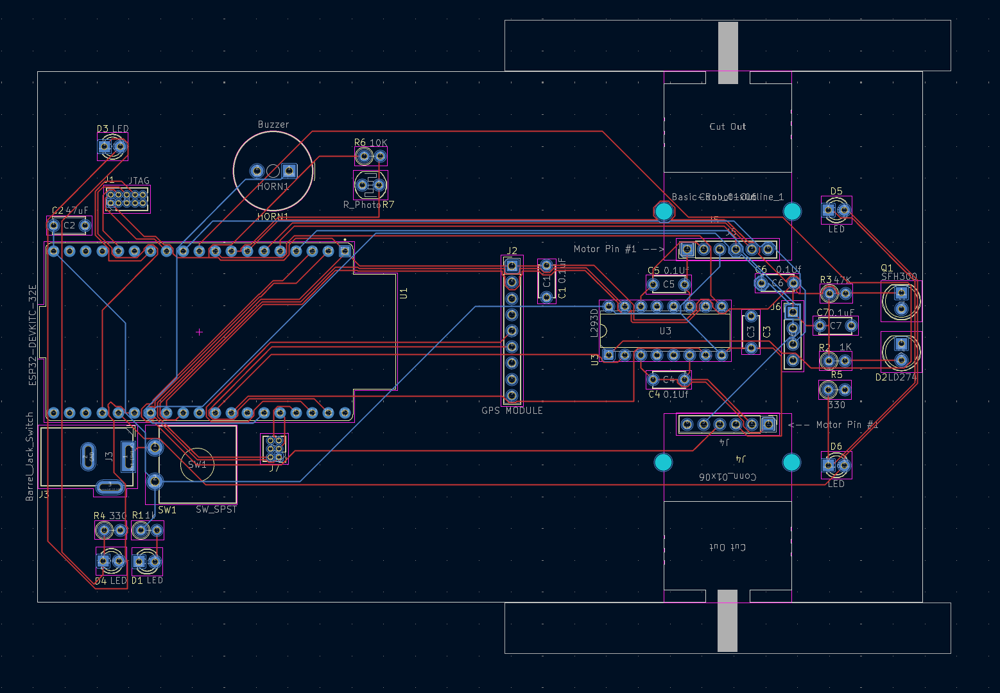

# REDHAWK ESP32 Embedded Systems Robot

A custom PCB-based robot designed and built for the **Seattle University Embedded Systems & Design** course. The board is centered around an ESP32 microcontroller and includes motor control, sensing, and interaction peripherals using KiCad 9.0.




---

## Project Structure

```
Mitchel_Ezekiel_Robot/
├── Mitchel_Ezekiel_Robot.kicad_pcb     # PCB layout
├── Mitchel_Ezekiel_Robot.kicad_sch     # Root schematic
├── Mitchel_Ezekiel_Robot.kicad_pro     # KiCad project file
├── docs/
│   ├── ESP32EmeddedRobot_Design-GetStarted-v00-1-10-2025a.pdf
│   └── images/                         # PCB renders and board photos
├── deliverables/
│   └── Ezekiel_Mitchell_ESP32_Robot_Schematic.kicad_sch
└── downloadables/
    ├── 0-My_Library.kicad_sym          # Custom symbol library
    └── 0-My-Library.pretty/            # Custom footprint library
```

---

## Hardware Overview

### Microcontroller
| Part | Description |
|------|-------------|
| ESP32-DEVKITC-32E | Main MCU — dual-core Xtensa LX6, Wi-Fi + Bluetooth |

### Motor Drive
| Part | Description |
|------|-------------|
| L293D | Dual H-bridge motor driver IC |
| Pololu-3675 | Gear motors with quadrature encoders (×2) |
| Pololu-2691 | Ball caster (rear support) |

### Sensors & I/O
| Part | Description |
|------|-------------|
| R_Photo | Photoresistor (light sensing) |
| R_US / LD274 / SFH300 | Ultrasonic/IR distance sensing components |
| Capacitive touch switches | ECE-Touch-Switch-Piano-Key (multiple variants) |
| Buzzer | Audio feedback |
| LED | Status indicator |

### Passives & Power
| Part | Value/Description |
|------|-------------------|
| C1 | 0.1 µF decoupling capacitor |
| R2 | 1 kΩ |
| R4, R5 | 330 Ω |
| J3 | Barrel jack with switch (battery input) |
| Various headers | 1×4, 1×6, 1×9, 2×3, 2×5 connectors |

---

## PCB Net Classes

| Net Class | Track Width | Via Drill | Notes |
|-----------|-------------|-----------|-------|
| Power | 0.5 mm | 0.5 mm | VCC, GND rails |
| Motor | 0.8 mm | 0.6 mm | H-bridge output lines |
| High Speed / GPS | 0.2 mm | 0.4 mm | High-frequency signals |
| Default | 0.2 mm | 0.3 mm | General signals |

---

## Tools & Libraries

- **KiCad 9.0** — schematic capture and PCB layout
- **Custom Symbol Library** — `0-My_Library.kicad_sym`
- **Custom Footprint Library** — `0-My-Library.pretty/`
  - `MODULE_ESP32-DEVKITC-32E`
  - `Pololu-3675-GearMotorWEncoder`
  - `Pololu-2691-Ball_Caster`
  - `Basic-Robot-Outline_1`
  - ECE capacitive and piano touch switch footprints
  - `BAT_2481`, `TRIM_PTA3043-2015DPA104`, and more

---

## Getting Started

1. Install [KiCad 9.0](https://www.kicad.org/)
2. Clone this repository
3. Open `Mitchel_Ezekiel_Robot/Mitchel_Ezekiel_Robot.kicad_pro` in KiCad
4. To use the custom library, add `downloadables/0-My-Library.pretty` as a footprint library and `downloadables/0-My_Library.kicad_sym` as a symbol library in KiCad's library manager
5. See `docs/ESP32EmeddedRobot_Design-GetStarted-v00-1-10-2025a.pdf` for the original design brief

---

## Author

**Ezekiel Mitchell** — Seattle University, Embedded Systems & Design
